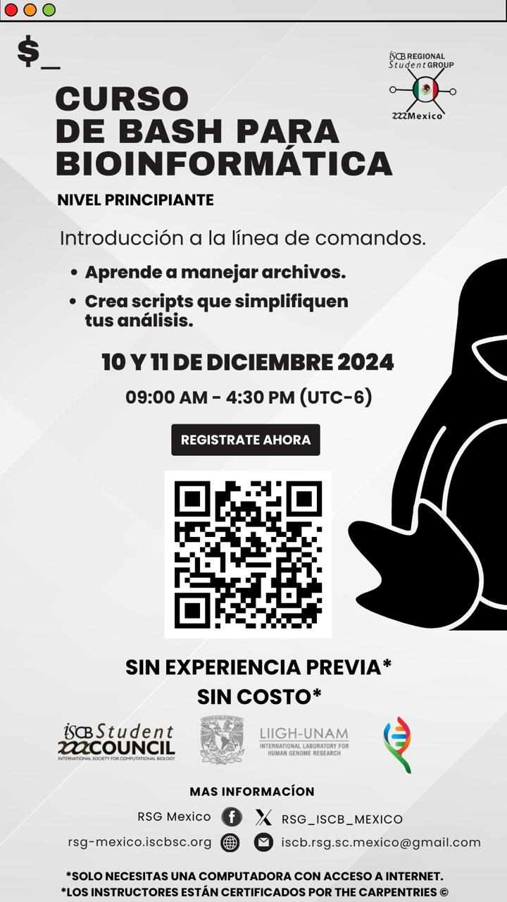

# Workshop Bash 2024

El contenido de este curso se realizó en base al material de Software Carpentry y RSG Ecuador. La literatura adicional se especifica en cada tema de forma pertinente.

-   Fechas: 10 y 11 diciembre 2024
-   Duración del curso: 3 horas
-   Instructures:
    -   **Evelia Lorena Coss-Navarrete** - PostDoc, LIIGH-UNAM. [Pagina web](https://eveliacoss.github.io/)
    -   **Aaron Espinosa Jaime -** Estudiante de maestria, Cinvestav-LANGEBIO.
-   Ayudantes:
    -   **Daniel Chávez** - Profesor invitado, UAGro.
    -   **Camilo Pérez** - Estudiante de doctorado, Cinvestav-LANGEBIO.
    -   **Abel Lovaco Flores -** Estudiante de maestria, Cinvestav-Irapuato.
    -   **Israel Aguilar** - Posdoc, Tec de Monterrey.

## Resumen

Este tutorial te enseñará los conceptos fundamentales en el empleo y manejo de Bash Shell, incluyendo la creación de scripts de Bash, generación de programas con funcionalidades sencillas aplicables a bioinformática y a programación en general.

## Objetivos

-   En esta guía rápida aprenderás a:

    1.  Mis primeros pasos en bash.
    2.  Consultar información sobre archivos y directorios.
    3.  Permisos y como cambiarlos.
    4.  Información general sobre el Análisis de datos de RNA-Seq
    5.  Wildcards y Streams
    6.  Operadores de redirección de datos I/O
    7.  Edición de archivos con los editores de texto y con `sed`
    8.  Buenas prácticas
    9.  Generación de ligas simbólicas a archivos y orden en directorios
    10. Filtrado de texto (grep, cut, sort, uniq, wc) 
    11. Condicionales y bucles (for loops)
    12. Crear un script en Bash.

## Citar y reutilizar el material del curso

Los datos del curso se pueden reutilizar y adaptar libremente con la debida atribución. Todos los datos de los cursos de estos repositorios están sujetos a la licencia [Attribution-NonCommercial-ShareAlike 4.0 International (CC BY-NC-SA 4.0)](https://creativecommons.org/licenses/by-nc-sa/4.0/).

## Requisitos previos

-   Debes tener contar con una computadora con acceso a internet.
-   Te proporcionaremos una cuenta a BetterLab para tener acceso a la **terminal de Bash Shell**.
